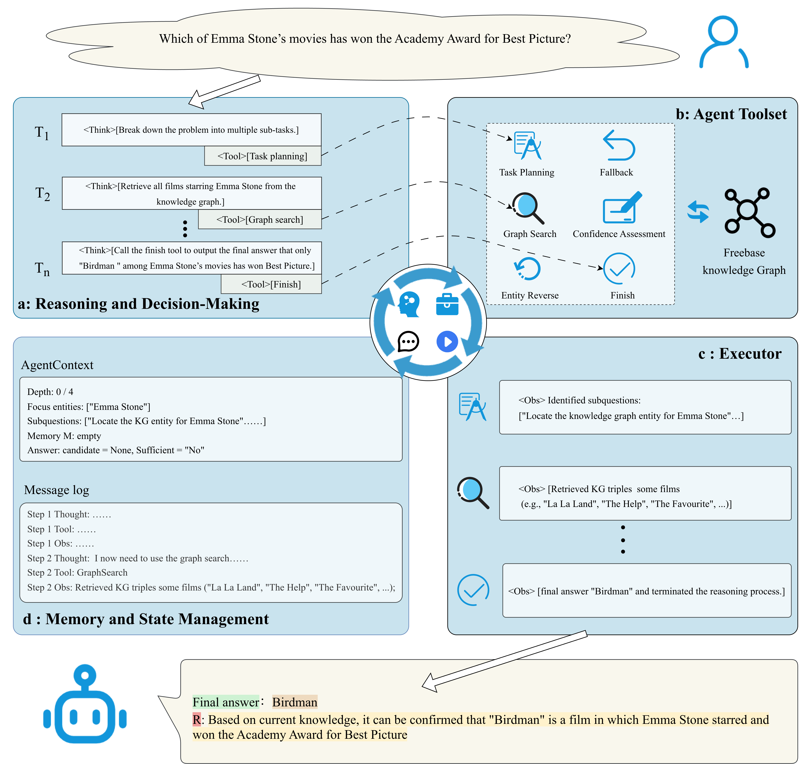
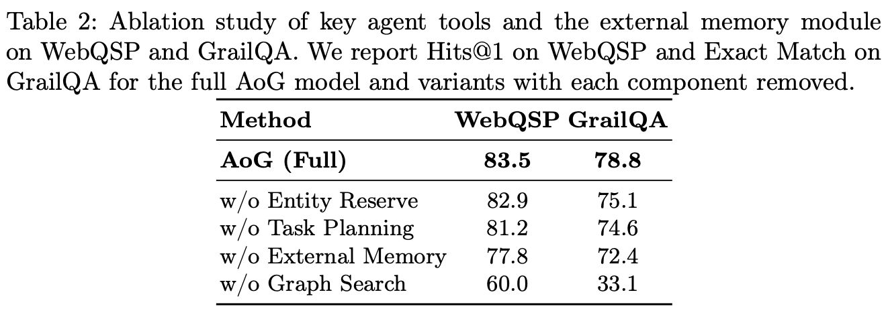

# Agent-on-Graph

The code for paper: "Agent-on-Graph: An Autonomous Agent Framework for  Multi-Hop Reasoning over Knowledge Graph".

## The framework of AoG



Overall architecture of the proposed AoG framework and an example reasoning trace for a sample question. AoG alternates a ReAct-style “think–act–observe” loop across four modules—reasoning and decision-making, agent toolset, executor, and memory and state management—to build graph-grounded evidence chains and derive the final answer.


## Run preparation

Before running AoG, please ensure that you have successfully installed **Freebase** on your local machine. Please follow the [installation instructions](https://github.com/GasolSun36/ToG/tree/main/Freebase). 


## How to run

```bash
python main_freebase.py \  
--dataset webqsp \ # the dataset
--LLM_type qwen-plus \ # the LLM
--opeani_api_keys sk-xxxx \ # your own api keys
```


## How to eval

```bash
python eval.py AoG_webqsp_qwen-turbo.jsonl # the result file 
```


## Experiment result

### Performance comparison of AoG


### Ablation study of AoG



## Appreciation

Our codes are modified based on the public project [ToG](https://github.com/GasolSun36/ToG) and [PoG](https://github.com/liyichen-cly/PoG) We appreciate the authors for making ToG and PoG open-sourced.